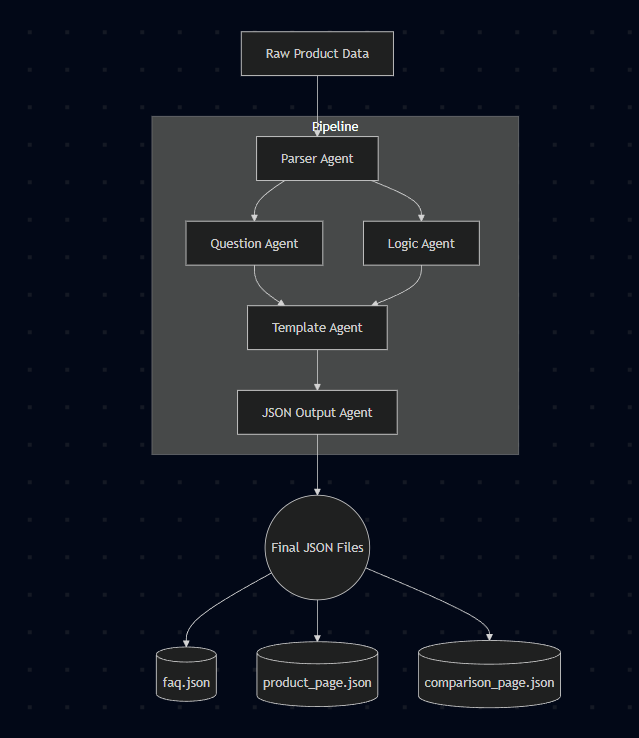

# Multi-Agent Content Generation System

## 1. Problem Statement

Manual creation of product content such as FAQs, product description pages, and comparison summaries is time-consuming, repetitive, and prone to inconsistencies.  
E-commerce brands and product teams need automated systems that transform raw product details into structured, reusable, and machine-readable formats without manual rewriting.

This project aims to design a **multi-agent modular automation system** that:

- Parses raw product data
- Generates user-centric questions automatically
- Creates reusable content logic blocks
- Assembles content pages via templates
- Outputs JSON content pages suitable for publishing

---

## 2. Solution Overview

The system is built as a **modular multi-agent pipeline**, where each agent performs a single responsibility and passes its output to the next step.

The pipeline consists of:

- Parsing Agent (data understanding & normalization)
- Question Generation Agent (creates 15+ categorized questions)
- Logic Block Agent (formats reusable text blocks)
- Template Agent (assembles content pages)
- JSON Export Agent (writes structured machine-readable content)

The pipeline automatically generates and stores:

- `faq.json`
- `product_page.json`
- `comparison_page.json`

All output files are saved inside the `/output` directory.

---

## 3. Scope & Assumptions

### Scope

- Works with structured product dataset of limited fields
- Generates categorized FAQ questions and content pages automatically
- Enables reusable logic blocks for future scalability
- Structured JSON format ready for integration in UI/product catalog systems

### Assumptions

- No external research or internet-based data enhancements allowed
- Only raw input dataset from assignment is used
- Comparison uses fictional Product B as permitted
- No frontend or UI components included (not required in assignment)

---

## 4. System Design

### 4.1 Pipeline Flow Diagram

Raw Product Data
↓
Parser Agent
↓
Question Agent
↓
Logic Agent
↓
Template Agent
↓
JSON Output Agent
↓
Final JSON Content Files

yaml

Diagram Representation:

  

---

### 4.2 Agent Responsibilities

| Agent Name      | Responsibility                        | Input                    | Output                               |
| --------------- | ------------------------------------- | ------------------------ | ------------------------------------ |
| ParserAgent     | Converts raw text to structured model | Raw dataset              | Clean product dict                   |
| QuestionAgent   | Generates categorized questions       | Structured product model | Dictionary of categories + questions |
| LogicAgent      | Builds reusable content blocks        | Structured product       | Readable formatted text blocks       |
| TemplateAgent   | Assembles final page structure        | blocks + questions       | Page dictionaries                    |
| JSONOutputAgent | Saves pages as JSON                   | Page dictionaries        | JSON files in /output                |
| Orchestrator    | Runs pipeline in required sequence    | –                        | End-to-end automation                |

---

## 5. Orchestrator Workflow

Initialize agents →
Parse product data →
Generate categorized questions →
Create logic blocks →
Assemble content pages using templates →
Export pages to JSON →
Store in output directory

yaml
Copy code

This architecture ensures:

- Clear modular boundaries
- Scalable, testable code components
- No monolithic processing
- High maintainability

---

## 6. Output Files

Generated inside `/output/` directory:

- **faq.json**
- **product_page.json**
- **comparison_page.json**

Each file contains:

- Clean JSON
- Predictable structure
- Ready for downstream integration

---

## 7. Conclusion

This project demonstrates a modular and extensible multi-agent automation system for structured content generation.  
The workflow converts raw product data into formatted page outputs, maintaining reusable logic and template-driven structure.

It validates engineering principles including:

- Clear responsibility separation
- Agent orchestration flow
- Reusability and template-based design
- Machine-readable structured JSON output

Future enhancements include:

- AI-powered answer generation
- Multi-product batch processing
- Workflow DAG engines (Prefect / LangGraph / Ray)
- Template file separation & dynamic comparison models
